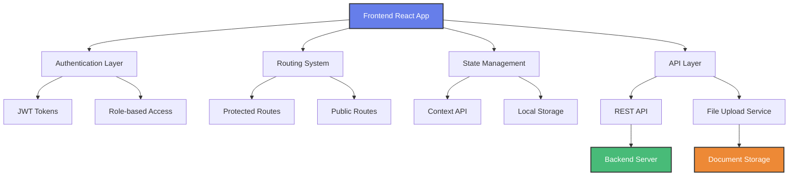

# 🎯 Fursa - Internship Platform Frontend

<div align="center">


*"Connecting ambitious students with industry-leading companies across Saudi Arabia"*

[🚀 Live Demo](#) | [📚 Documentation](#api-documentation) | [🐛 Report Issues](https://github.com/innosoft/fursa/issues)

</div>

---

## 📖 Table of Contents

- [🎯 Overview](#-overview)
- [✨ Features](#-features) 
- [🏗️ Architecture](#️-architecture)
- [🚀 Quick Start](#-quick-start)
- [📁 Project Structure](#-project-structure)
- [📚 API Documentation](#-api-documentation)
- [⚙️ Setup Instructions](#️-setup-instructions)
- [🧪 Testing & Deployment](#-testing--deployment)
- [🤝 Contributing](#-contributing)

---

## 🎯 Overview

**Fursa** is a modern, bilingual internship platform that bridges the gap between talented students and innovative companies across Saudi Arabia. Built with cutting-edge React technology, it provides a seamless experience for both students seeking career opportunities and companies looking for fresh talent.

### 🎯 Problem It Solves
- **For Students**: Difficulty finding quality internship opportunities and tracking application status
- **For Companies**: Challenges in discovering talented interns and managing applications efficiently
- **For Both**: Lack of a centralized, user-friendly platform for internship management

### 👥 Target Audience
- **Students**: University students and recent graduates seeking internship opportunities
- **Companies**: Businesses of all sizes looking to recruit intern talent
- **Educational Institutions**: Universities and colleges facilitating student placements

### 🌟 Key Highlights
- **Dual User System**: Separate portals for students and companies with role-based access
- **Bilingual Support**: Full Arabic and English localization with RTL support
- **Modern UI/UX**: Beautiful, responsive design using Chakra UI and Tailwind CSS
- **Real-time Features**: Live application status tracking and notifications
- **Security-First**: JWT authentication with token refresh and secure file uploads
- **Performance Optimized**: Code splitting, lazy loading, and optimized bundle sizes

---

## ✨ Features

### 🎨 User Interface & Experience
- **🌙 Dark/Light Mode**: Seamless theme switching with system preference detection
- **🌍 Internationalization**: Complete Arabic/English localization with RTL layout support
- **📱 Responsive Design**: Mobile-first approach ensuring perfect experience across all devices
- **🎭 Component Library**: Consistent design system using Chakra UI components
- **⚡ Performance**: Optimized loading with skeleton screens and progressive enhancement

### 🔐 Authentication & Authorization
- **🛡️ JWT Security**: Secure token-based authentication with automatic refresh
- **👤 Role-Based Access**: Separate dashboards and permissions for students and companies
- **🔄 Session Management**: Persistent login state with secure token storage
- **📝 Profile Setup**: Guided onboarding process for both user types
- **🚪 Protected Routes**: Comprehensive route protection based on authentication status

### 💼 Core Internship Features
- **🔍 Advanced Search**: Multi-criteria search with location, type, and keyword filtering
- **📋 Application Management**: File upload support for resumes and cover letters (PDF, DOC, DOCX)
- **📊 Status Tracking**: Real-time application status updates with visual indicators
- **📅 Deadline Management**: Automated deadline tracking and notifications
- **💾 Draft System**: Save and resume applications with auto-save functionality

### 🏢 Company Management
- **📈 Dashboard Analytics**: Comprehensive overview of posted internships and applications
- **👥 Applicant Management**: Review, filter, and manage applicant profiles
- **📄 Document Access**: Secure download and viewing of student resumes and cover letters
- **✏️ Internship CRUD**: Full create, read, update, delete operations for internship postings
- **🎯 Application Filtering**: Advanced filtering by status, date, and applicant criteria

### 🔧 Technical Features
- **🚀 Performance**: Code splitting, lazy loading, and optimized React components
- **🛠️ Error Handling**: Comprehensive error boundaries and user-friendly error messages
- **📱 PWA Ready**: Service worker support for offline functionality
- **🔄 Auto-Retry**: Automatic retry logic for failed API requests
- **📊 Monitoring**: Built-in performance monitoring and error tracking

---

## 🏗️ Architecture

### 🗺️ System Architecture



### 🛠️ Technology Stack

| Category | Technology | Version | Purpose |
|----------|------------|---------|---------|
| **Frontend Framework** | React | 18.2.0 | Core application framework |
| **UI Library** | Chakra UI | 2.10.9 | Component library and design system |
| **Styling** | Tailwind CSS | 3.4.17 | Utility-first CSS framework |
| **Routing** | React Router DOM | 7.6.2 | Client-side routing and navigation |
| **State Management** | React Context API | Built-in | Global state management |
| **HTTP Client** | Axios | 1.10.0 | API communication |
| **Internationalization** | i18next | 25.2.1 | Multi-language support |
| **Animation** | Framer Motion | 10.18.0 | Smooth animations and transitions |
| **Icons** | React Icons | 5.5.0 | Comprehensive icon library |
| **File Handling** | React PDF | 9.2.1 | PDF document handling |
| **Notifications** | React Toastify | 11.0.5 | User feedback system |
| **Theme Management** | next-themes | 0.4.6 | Dark/light mode switching |
| **Build Tool** | Create React App | 5.0.1 | Development and build tooling |
| **Testing** | React Testing Library | 16.3.0 | Component testing framework |

---

## 🚀 Quick Start

### 📋 Prerequisites

- **Node.js**: v18.0.0 or higher
- **npm**: v8.0.0 or higher
- **Git**: Latest version
- **Backend API**: Fursa backend server running on port 3000

### ⚡ Installation

1. **Clone the repository**
   ```bash
   git clone https://github.com/innosoft/fursa.git
   cd fursa/web/frontend
   ```

2. **Install dependencies**
   ```bash
   npm install
   ```

3. **Environment setup**
   ```bash
   # Create environment file
   cp .env.example .env.local
   
   # Configure API endpoint
   echo "REACT_APP_API_URL=http://localhost:3000" >> .env.local
   ```

4. **Start development server**
   ```bash
   npm start
   ```

5. **Access the application**
   - 🌐 **Frontend**: http://localhost:3001
   - 📡 **API**: http://localhost:3000
   - 📱 **Mobile Preview**: Available on network IP

### 🔧 Environment Variables

```bash
# API Configuration
REACT_APP_API_URL=http://localhost:3000

# Feature Flags
REACT_APP_ENABLE_PWA=true
REACT_APP_ENABLE_ANALYTICS=false

# Development Settings
GENERATE_SOURCEMAP=true
REACT_APP_DEBUG_MODE=true
```

---

## 📁 Project Structure

```
📁 frontend/
├── 📁 public/                    # Static assets
│   ├── 🖼️ favicon.ico           # Application favicon
│   ├── 🖼️ logo.png              # Company logo
│   ├── 📄 manifest.json         # PWA manifest
│   └── 🤖 robots.txt            # SEO robots file
├── 📁 src/                       # Source code
│   ├── 📄 App.js                 # Main application component
│   ├── 📄 index.js               # Application entry point
│   ├── 📄 config.js              # Configuration settings
│   ├── 🌍 i18n.js                # Internationalization setup
│   ├── 🎨 theme.js               # Chakra UI theme configuration
│   ├── 📁 components/            # Reusable UI components
│   │   ├── 🧭 Navbar.js          # Navigation component
│   │   ├── 🦶 Footer.js          # Footer component
│   │   ├── 🔍 SearchBar.js       # Search functionality
│   │   ├── 🏷️ InternshipStatusBadge.js # Status indicators
│   │   ├── 🔄 InternshipFilter.js # Filtering controls
│   │   ├── 🌙 ThemeToggle.js     # Dark/light mode toggle
│   │   ├── 🌍 LanguageSwitcher.js # Language selection
│   │   └── 📁 ui/                # Base UI components
│   │       ├── 🎨 provider.js    # UI theme provider
│   │       ├── 🍞 toaster.jsx    # Toast notifications
│   │       └── 💡 tooltip.jsx    # Tooltip component
│   ├── 📁 context/               # React Context providers
│   │   └── 🔐 AuthContext.js     # Authentication state management
│   ├── 📁 pages/                 # Application pages
│   │   ├── 📁 Authentication/    # Auth-related pages
│   │   │   ├── 🔑 LoginPage.js   # User login
│   │   │   ├── 📝 SignupPage.js  # User registration
│   │   │   ├── 🏢 CompanyProfileSetUpPage.js # Company onboarding
│   │   │   └── 🎓 StudentProfileSetupPage.js # Student onboarding
│   │   ├── 📁 homepages/         # Landing pages
│   │   │   └── 🏠 HomePage.js    # Main dashboard
│   │   ├── 📁 internship/        # Internship management
│   │   │   ├── 📋 AllInternshipsPage.js # Internship listings
│   │   │   ├── 🔍 SearchInternshipsPage.js # Search interface
│   │   │   ├── 📄 InternshipDetail.js # Detailed view
│   │   │   ├── ➕ CreateInternship.js # Create new posting
│   │   │   ├── ✏️ EditInternship.js # Edit existing posting
│   │   │   ├── 📝 ApplyInternshipForm.js # Application form
│   │   │   ├── 👥 InternshipApplicantsPage.js # Manage applicants
│   │   │   └── 👤 ApplicantDetailPage.js # Individual applicant view
│   │   ├── 📁 student/           # Student-specific pages
│   │   │   └── 📊 StatusPage.js  # Application tracking
│   │   ├── 📁 company/           # Company-specific pages
│   │   │   ├── 🏢 CompaniesPage.js # Company directory
│   │   │   └── 📈 CompanyInternshipStatusPage.js # Company dashboard
│   │   └── 📁 settings/          # User settings
│   │       └── ⚙️ SettingsPage.js # Profile management
│   ├── 📁 utils/                 # Utility functions
│   │   └── 🔒 security.js        # Security helpers
│   └── 📁 styles/                # Styling files
│       ├── 🎨 App.css            # Global styles
│       └── 📱 index.css          # Base styles
├── 📄 package.json               # Project dependencies
├── 🐳 Dockerfile                 # Production container
├── 🐳 Dockerfile.dev             # Development container
├── 🐳 docker-compose.yml         # Docker orchestration
├── 🎨 tailwind.config.js         # Tailwind configuration
├── 🔧 postcss.config.js          # PostCSS configuration
└── 📖 README.md                  # Project documentation
```

### 📂 Directory Explanations

- **`/components`**: Reusable UI components following atomic design principles
- **`/pages`**: Route-specific page components organized by feature area
- **`/context`**: React Context providers for global state management
- **`/utils`**: Pure utility functions and helper modules
- **`/styles`**: CSS and styling configuration files

---

## 📚 API Documentation

### 🔗 Core Endpoints

| Endpoint | Method | Description | Authentication |
|----------|--------|-------------|----------------|
| `/auth/login` | POST | User authentication | Public |
| `/auth/signup` | POST | User registration | Public |
| `/internships` | GET | List internships | Required |
| `/internships` | POST | Create internship | Company only |
| `/internships/:id` | GET | Get internship details | Required |
| `/internships/:id` | PUT | Update internship | Company only |
| `/internships/:id` | DELETE | Delete internship | Company only |
| `/applications` | GET | List applications | Required |
| `/applications` | POST | Submit application | Student only |
| `/applications/:id` | GET | Get application details | Required |

### 📋 Component Library

#### Core Components
```jsx
// Navigation Component
import { Navbar } from './components/Navbar';
<Navbar />

// Status Badge
import { InternshipStatusBadge } from './components/InternshipStatusBadge';
<InternshipStatusBadge isOpen={true} deadline="2025-07-01" />

// Theme Toggle
import { ThemeToggle } from './components/ThemeToggle';
<ThemeToggle />
```

#### Form Components
```jsx
// Application Form
import { ApplyInternshipForm } from './pages/internship/ApplyInternshipForm';
<ApplyInternshipForm internshipId="123" />

// Search Interface
import { SearchBar } from './components/SearchBar';
<SearchBar onSearch={handleSearch} onFilter={handleFilter} />
```

### 🔧 Authentication Flow
```javascript
// Login Process
const { login } = useAuth();
const result = await login({ email, password });

// Token Refresh
const { refresh } = useAuth();
const newToken = await refresh();

// Protected API Call
const response = await fetch('/api/endpoint', {
  headers: {
    'Authorization': `Bearer ${accessToken}`
  }
});
```

> 📖 **Documentation Access**: 
> - **API Documentation**: Available at `/api/docs` when backend is running
> - **Component Storybook**: Run `npm run storybook` for interactive component documentation

---

## ⚙️ Setup Instructions

### 🔧 Development Environment

1. **Install Node.js and npm**
   ```bash
   # Using Node Version Manager (recommended)
   curl -o- https://raw.githubusercontent.com/nvm-sh/nvm/v0.39.0/install.sh | bash
   nvm install 18
   nvm use 18
   ```

2. **Clone and setup project**
   ```bash
   git clone https://github.com/innosoft/fursa.git
   cd fursa/web/frontend
   npm install
   ```

3. **Configure environment**
   ```bash
   # Development environment
   cp .env.example .env.local
   
   # Production environment
   cp .env.example .env.production
   ```

4. **Start development servers**
   ```bash
   # Frontend development server
   npm start
   
   # Backend API server (in separate terminal)
   cd ../backend
   npm run dev
   ```

### 🌐 Environment Configuration

#### Development (.env.local)
```bash
REACT_APP_API_URL=http://localhost:3000
REACT_APP_ENVIRONMENT=development
REACT_APP_DEBUG_MODE=true
GENERATE_SOURCEMAP=true
```

#### Production (.env.production)
```bash
REACT_APP_API_URL=https://api.fursa.com
REACT_APP_ENVIRONMENT=production
REACT_APP_DEBUG_MODE=false
GENERATE_SOURCEMAP=false
```

### 🔧 IDE Configuration

#### VS Code Extensions (Recommended)
```json
{
  "recommendations": [
    "bradlc.vscode-tailwindcss",
    "ms-vscode.vscode-typescript-next",
    "esbenp.prettier-vscode",
    "dbaeumer.vscode-eslint",
    "ms-vscode.vscode-react-native"
  ]
}
```

#### VS Code Settings
```json
{
  "editor.formatOnSave": true,
  "editor.defaultFormatter": "esbenp.prettier-vscode",
  "emmet.includeLanguages": {
    "javascript": "javascriptreact"
  }
}
```

---

## 🧪 Testing & Deployment

### 🧪 Testing Strategy

#### Unit Testing
```bash
# Run all tests
npm test

# Run tests in watch mode
npm run test:watch

# Generate coverage report
npm run test:coverage
```

#### Component Testing
```javascript
// Example test structure
import { render, screen } from '@testing-library/react';
import { InternshipCard } from './InternshipCard';

test('renders internship card with correct data', () => {
  const mockInternship = {
    title: 'Software Engineer Intern',
    company: 'TechCorp',
    location: 'Riyadh'
  };
  
  render(<InternshipCard internship={mockInternship} />);
  expect(screen.getByText('Software Engineer Intern')).toBeInTheDocument();
});
```

#### Integration Testing
```bash
# End-to-end testing with Cypress
npm run test:e2e

# Visual regression testing
npm run test:visual
```

### 🐳 Docker Deployment

#### Development Container
```bash
# Build development image
docker build -f Dockerfile.dev -t fursa-frontend:dev .

# Run development container
docker run -p 3001:3001 -v $(pwd):/app fursa-frontend:dev
```

#### Production Container
```bash
# Build production image
docker build -t fursa-frontend:prod .

# Run production container
docker run -p 80:80 fursa-frontend:prod
```

#### Docker Compose
```yaml
# docker-compose.yml
version: '3.8'
services:
  frontend:
    build: .
    ports:
      - "3001:80"
    environment:
      - REACT_APP_API_URL=http://localhost:3000
    depends_on:
      - backend
```

### 🚀 Production Deployment

#### Build Optimization
```bash
# Create optimized production build
npm run build

# Analyze bundle size
npm run analyze

# Serve build locally for testing
npm install -g serve
serve -s build -l 3001
```

#### Deployment Checklist
- [ ] Environment variables configured
- [ ] API endpoints accessible
- [ ] SSL certificates installed
- [ ] CDN configured for static assets
- [ ] Error tracking configured
- [ ] Performance monitoring enabled
- [ ] Backup strategy implemented

#### Deployment Commands
```bash
# Deploy to staging
npm run deploy:staging

# Deploy to production
npm run deploy:production

# Rollback deployment
npm run rollback
```

---

## 🤝 Contributing

### 🔄 Development Workflow

1. **Fork the repository**
   ```bash
   git clone https://github.com/your-username/fursa.git
   cd fursa/web/frontend
   ```

2. **Create feature branch**
   ```bash
   git checkout -b feature/your-feature-name
   ```

3. **Make changes and commit**
   ```bash
   git add .
   git commit -m "feat: add new feature description"
   ```

4. **Push and create pull request**
   ```bash
   git push origin feature/your-feature-name
   ```

### 📝 Code Standards

#### Naming Conventions
```javascript
// Components: PascalCase
const InternshipCard = () => { };

// Variables: camelCase
const userProfile = { };

// Constants: UPPER_SNAKE_CASE
const API_BASE_URL = 'http://localhost:3000';

// Files: PascalCase for components, camelCase for utilities
InternshipCard.js
authHelpers.js
```

#### Code Structure
```javascript
// Import order
import React from 'react'; // React imports
import { useState } from 'react'; // React hooks
import { Box, Text } from '@chakra-ui/react'; // UI library imports
import { useAuth } from '../context/AuthContext'; // Local imports
import './Component.css'; // Style imports

// Component structure
const ComponentName = ({ prop1, prop2 }) => {
  // Hooks
  const [state, setState] = useState(null);
  const { user } = useAuth();
  
  // Functions
  const handleAction = () => {
    // Implementation
  };
  
  // Render
  return (
    <Box>
      <Text>{/* JSX */}</Text>
    </Box>
  );
};

export default ComponentName;
```

#### Git Commit Convention
```bash
feat: add new feature
fix: bug fix
docs: documentation update
style: formatting changes
refactor: code refactoring
test: add or modify tests
chore: maintenance tasks
```

### 🐛 Bug Reporting

#### Issue Template
```markdown
**Bug Description**
Clear description of the bug

**Steps to Reproduce**
1. Go to '...'
2. Click on '...'
3. Scroll down to '...'
4. See error

**Expected Behavior**
What you expected to happen

**Screenshots**
If applicable, add screenshots

**Environment**
- OS: [e.g. iOS]
- Browser: [e.g. Chrome, Safari]
- Version: [e.g. 22]
```

### 🚀 Feature Requests

#### Feature Template
```markdown
**Feature Description**
Clear description of the proposed feature

**Use Case**
Explain the problem this feature would solve

**Proposed Solution**
Describe your preferred solution

**Alternatives**
Describe alternatives you've considered

**Additional Context**
Add any other context or screenshots
```

### 📞 Support & Contact

- **📧 Email**: support@fursa.com
- **💬 Discord**: [Fursa Community](https://discord.gg/fursa)
- **📱 Twitter**: [@FursaPlatform](https://twitter.com/FursaPlatform)
- **🌐 Website**: [www.fursa.com](https://www.fursa.com)
- **📋 Issues**: [GitHub Issues](https://github.com/innosoft/fursa/issues)

---

<div align="center">

**Made with ❤️ by the Fursa Team**

*Empowering the next generation of Saudi professionals*

[⬆️ Back to Top](#-fursa---internship-platform-frontend)

</div>
